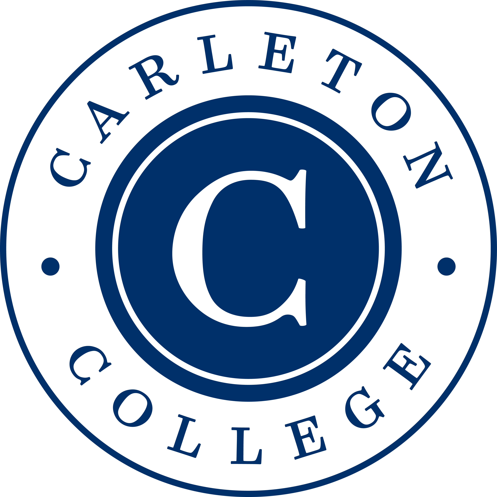

::: {#intro-heading}
Hi, thanks for visiting Vivian's wesbite! 

## Education

**Carleton College** | Northfield, MN | B.A. in Statistics and Sociology/Anthropology | 2023-2027 *(expected)*

## Experience

This summer I am participating in the [Carnegie Mellon Sports Analytics Camp (CMSACamp)](https://www.cmu.edu/dietrich/statistics-datascience/engagement/summer/cmsa-camp.html).

 
:::

### About me

